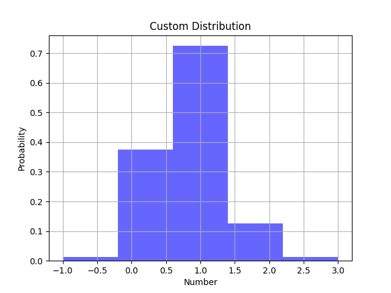
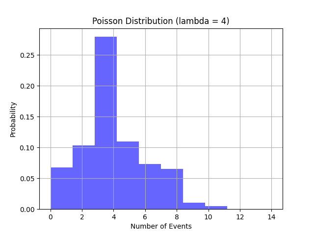
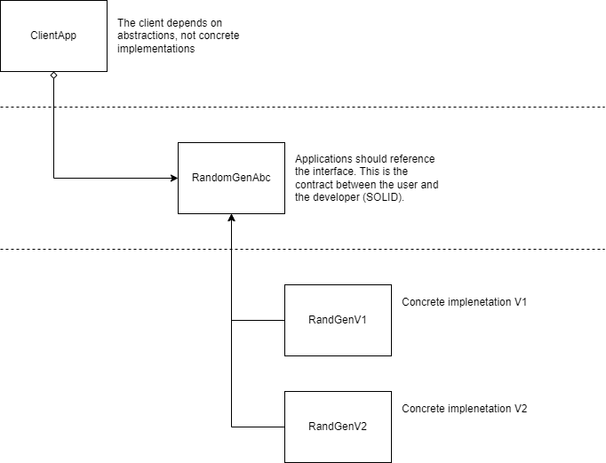

## Problem Statement

Given Random Numbers are [-1, 0, 1, 2, 3] and Probabilities are [0.01, 0.3, 
0.58, 0.1, 0.01] if we call nextNum() 100 times, we may get the following 
results. As the results are random, these particular results are unlikely.

```text
-1: 1 times
0: 22 times
1: 57 times
2: 20 times
3: 0 times
```

**Instructions:**

 - Write a random number generator that returns numbers based on the 
   probabilities provided.
 - Implement the method nextNum() and a minimal but effective set of unit tests.
 - Implement in the language of your choice, Python is preferred, but Java and 
   other languages are completely fine.
 - Make sure your code is exemplary, as if it was going to be shipped as part 
   of a production system.

You may use random.random() which returns a pseudo random number between 0 
and 1. 

```python
import random

class RandomGen(object):
  
  # Values that may be returned by next_num()
  _random_nums = []
  
  # Probability of the occurrence of random_nums
  _probabilities = []
  
def next_num(self):
    """
    Returns one of the randomNums. When this method is called multiple
    times over a long period, it should return the numbers roughly with
    the initialized probabilities.
    """
    pass 

```

## Solution Journal

### 1. Select the technology stack

- Language: Python 3.12+
- Testing: Pytest
- Version Control: Git
- Git Hosting: GitHub
- CI/CD: GitHub Actions
- Documentation: MkDocs

### 2. Validate the data from the problem statement

Let's first check if the given numbers are correct. As QA engineer, the data
given is never trusted ;)

1. Is the length of random_nums and probabilities equal?
2. Is the sum of probabilities equal to 1?
3. Are all probabilities positive?

A manual check is enough for this task. 

1. Yes, the length of random_nums and probabilities is equal.
2. Yes, the sum of probabilities is equal to 1.
3. Yes, all probabilities are positive.

We can proceed with the implementation.

### 3. Questions, questions and more questions

We don't have any information on how the data is generated, for example, how 
many samples were taken to get the given distribution. Typically, this may lead
to skewed results due to under-sampling. Visually, our distribution looks like a
custom distribution.



It doesn't seem to be a binomial distribution... 


... or a Poisson distribution.



We will assume that the given distribution is correct and proceed with the
implementation. We will test our implementation with a large number of samples
for fairness using the Chi-Squared test.

### 4. Proof of concept

```python
import random

class RandomGen(object):
    
  def __init__(self, random_nums, probabilities):
    self._random_nums = random_nums
    self._probabilities = probabilities
      
  def next_num(self):
    return random.choices(self._random_nums, self._probabilities)[0]
```

Questions:

1. Do we have constraints regarding the compatibility with older versions of 
   Python?
2. Are we allowed to use external libraries for statistical tests and 
   visualization?

### 5. Get creative and draw the system design

We will implement two classes, one using `random.choices` and the other using
`random.random`. We will provide an abstract class to be used as an interface for
both classes. It will also decouple implementation from client code.



A sample of the API design is shown below:

```text
# Create a random number generator
rg = (
    RandomGenV1()
    .set_random_nums([-1, 0, 1, 2, 3])
    .set_probabilities([0.01, 0.3, 0.58, 0.1, 0.01])
    .validate_input()
)

# Get a random number
num = rg.next_num()
print("Random number is: ", num)
```

```text
 # Create a hypothesis test
 
 random_numbers = random.
 hypothesis = (
     ChiSquareTest()
     .set_random_numbers()
     .set_probabilities([0.01, 0.3, 0.58, 0.1, 0.01])
     .calc_chi()
     .calc_p()
     .test()
 )
 
 # Hypothesis is True if the distribution is fair
 print("Hypothesis is: ", hypothesis)
```

```text
 # Create a histogram object
 histogram = (
     Histogram()
     .set_random_numbers(random_numbers)
     .build()
     .plot()
 )
 
 # Print the histogram
 print(hist)
```

Typically, at this stage the client shall approve the design, and we can proceed with the 
prototype implementation.

### 6. Implement the core

We will implement the following classes:

1. `RandomGenAbc`: An abstract class to be used as an interface.
2. `RandomGenV1`: A class using `random.choices`.
3. `RandomGenV2`: A class using `random.random`.
4. `Histogram`: A helper class that creates a simple histogram object.
5. `ChiSquaredTest`: A helper class to perform the Chi-Squared test.

### 7. Implement the REST API with Flask

We will implement a simple REST API using Flask to access the solution. The API
will have the following endpoints:

1. `/api/v1/randomgen?number`: Returns a number of random numbers based on
   the random.random method.
1. `/api/v2/randomgen?number`: Returns a number of random numbers based on
   the random.choice method.

### 8. Manual Integration tests

The following problems arised during the manuals integration tests:

1. **Rounding errors**: Using older versions of Python yield rounding errors. Round the 
   probabilities to 3 decimal places.


2. **Fairness**: The Chi-Squared test is not fair in case the number of samples is low. The distribution is fair when the number of random values is above 50.


3. **Interface** We need to simplify the ChiSquaredTest class to make it more user-friendly. Define method calculate that will the chi-squared, p-value and the degrees of freedom.


4. **Configuration**: We will allow the user configure its own distribution using the parameters `numbers` and `probabilities` as defined in the problem statement.


### 9. Refactor the backend after the manual tests

Randomgen classes API:

```python
from randomgen.core import RandomGenV1

# Create a random number generator
rg = (
    RandomGenV1()
    .set_random_nums([-1, 0, 1, 2, 3])
    .set_probabilities([0.01, 0.3, 0.58, 0.1, 0.01])
    .validate()
)

# Get a random number
num = rg.next_num()
print("Random number is: ", num)
```

ChiSquaredTest API:

```
from randomgen.hypothesis import ChiSquareTest

# Create a hypothesis test
random_numbers = random.
hypothesis = (
  ChiSquareTest()
  .set_numbers()
  .set_probabilities([0.01, 0.3, 0.58, 0.1, 0.01])
  .calculate()
)

# Hypothesis is True if it is accepted
print("Hypothesis is: ", hypothesis.test())
```

Histogram API:

```
from randomgen.helpers import Histogram

# Create a histogram object
histogram = (
     Histogram()
     .set_numbers(random_numbers)
     .build()
     .plot()
)
 
# Print the histogram
print(hist)
```

### 10. Implement unit tests for the backend

**Functional tests**

We will implement unit tests for the Backend using Pytest. We will cover each class
and method with unit tests to guarantee that the solution is working as expected. 

The testing discovered some bugs in the implementation that are related to the validation of the 
input parameters. 

**Performance tests**

We will implement performance tests to check the performance of the solution. We will use the
maximum number of random numbers to check the performance of the solution. Manual testing showed
that RandomGenV2 is around 3 times slower than RandomGenV1.

The task definition doesn't mention any performance requirements. We will assume that the solution
should be fast enough to generate random numbers in a reasonable time. A reasonable time for the 
backend is around 50 msec, bearing in mind that the REST API is going to stack on it and add
some latency.

### 12. Implement automated integration tests for the REST API


### . Containerize

We will create a Dockerfile to containerize the solution. We will also create a
`docker-compose.yml` file to run the tests in a container. The application
will consist of a flask server that will implement a simple API to access
the solution. The container will guarantee that the solution will run on any
machine that has Docker installed.


### . CI/CD

We will create a GitHub Actions workflow to run the tests on every push to the
main branch. We will also create a GitHub Actions workflow to build and push the
Docker image to Docker Hub on every release.

### . Documentation

We will create MkDocs documentation to explain the solution and how to use it.


## Feedback from the client
